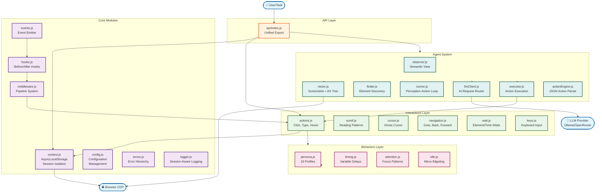
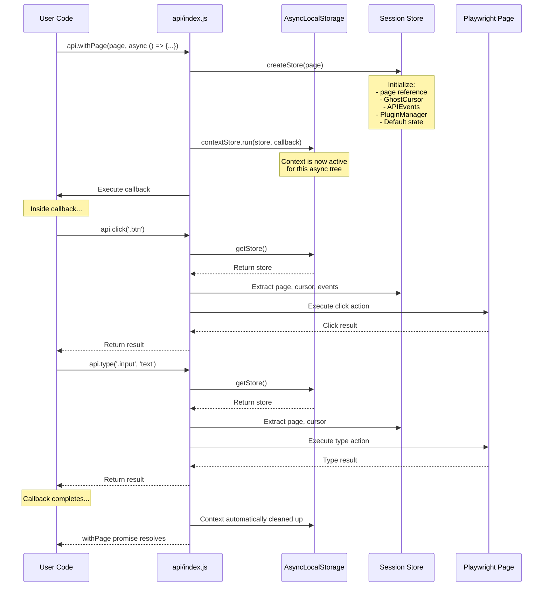
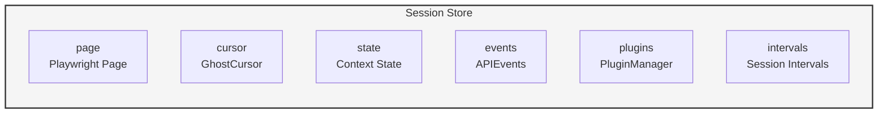

# Auto-AI API Architecture Documentation

This document provides comprehensive architectural diagrams and explanations for the Auto-AI Unified Browser Tool API.

## Table of Contents

1. [System Overview](#1-system-overview)
2. [Context Isolation Flow](#2-context-isolation-flow)
3. [Agent Perception-Action Loop](#3-agent-perception-action-loop)
4. [Middleware Pipeline](#4-middleware-pipeline)
5. [Error Hierarchy](#5-error-hierarchy)

---

## 1. System Overview

The Auto-AI API follows a layered architecture with clear separation of concerns. External systems interact through the unified API layer, which orchestrates core modules, interactions, behaviors, and the AI agent system.

### Architecture Diagram



### Component Descriptions

| Layer            | Component     | Responsibility                          |
| ---------------- | ------------- | --------------------------------------- |
| **External**     | User/Task     | Initiates automation goals              |
| **External**     | Browser CDP   | Playwright browser connection           |
| **External**     | LLM Provider  | AI decision making (Ollama/OpenRouter)  |
| **API**          | api/index.js  | Unified export, public interface        |
| **Core**         | context.js    | Session isolation via AsyncLocalStorage |
| **Core**         | config.js     | Settings management with caching        |
| **Core**         | errors.js     | Typed error hierarchy                   |
| **Core**         | events.js     | Session-scoped event emission           |
| **Core**         | hooks.js      | Before/after action wrappers            |
| **Core**         | middleware.js | Composable action pipeline              |
| **Interactions** | actions.js    | High-level kinetic actions              |
| **Interactions** | scroll.js     | Human-like reading patterns             |
| **Interactions** | cursor.js     | Ghost cursor physics                    |
| **Behaviors**    | persona.js    | 16 behavioral profiles                  |
| **Behaviors**    | timing.js     | Variable delay calculation              |
| **Agent**        | observer.js   | Semantic page understanding             |
| **Agent**        | runner.js     | Main perception-action loop             |
| **Agent**        | llmClient.js  | AI request routing                      |

---

## 2. Context Isolation Flow

The API uses Node.js `AsyncLocalStorage` to provide session isolation. Each browser page gets its own isolated context store containing the page reference, cursor instance, persona configuration, and event emitter.

### Sequence Diagram



### Context Store Structure



### Key Functions

| Function             | Purpose                                  |
| -------------------- | ---------------------------------------- |
| `withPage(page, fn)` | Execute function within isolated context |
| `getPage()`          | Retrieve current page from context       |
| `getCursor()`        | Retrieve GhostCursor instance            |
| `getEvents()`        | Retrieve event emitter                   |
| `isSessionActive()`  | Check if context is valid                |
| `clearContext()`     | Manually clear context (rarely needed)   |

---

## 3. Agent Perception-Action Loop

The Agent system implements an autonomous perception-action loop. It captures the page state, sends it to an LLM for decision making, executes the chosen action, and verifies the result before looping.

### Flowchart

```mermaid
flowchart TD
    Start([🎯 Agent Start<br/>Goal: "Login to Twitter"]) --> Init[Initialize Runner]
    Init --> CaptureState

    subgraph Perception["Perception Phase"]
        CaptureState[Capture State]
        CaptureState --> Screenshot[Take Screenshot]
        CaptureState --> AXTrees[Capture AX Tree]
        CaptureState --> GetURL[Get Current URL]
        Screenshot --> BuildPrompt
        AXTrees --> BuildPrompt
        GetURL --> BuildPrompt
    end

    BuildPrompt[Build LLM Prompt<br/>System + History + State] --> LLMGenerate[LLM Generate<br/>Ollama/OpenRouter]

    subgraph Decision["Decision Phase"]
        LLMGenerate --> ParseResponse[Parse JSON Response]
        ParseResponse --> ValidateResponse{Valid JSON?}
        ValidateResponse -->|No| RetryPrompt[Retry with<br/>error feedback]
        RetryPrompt --> LLMGenerate
        ValidateResponse -->|Yes| CheckAction{Action Type?}
    end

    subgraph Execution["Execution Phase"]
        CheckAction -->|click| ExecClick[Execute Click]
        CheckAction -->|type| ExecType[Execute Type]
        CheckAction -->|scroll| ExecScroll[Execute Scroll]
        CheckAction -->|navigate| ExecNav[Execute Navigate]
        CheckAction -->|wait| ExecWait[Execute Wait]
        CheckAction -->|done| Done([✅ Goal Complete])
        CheckAction -->|error| Error([❌ Error])
    end

    ExecClick --> VerifyAction
    ExecType --> VerifyAction
    ExecScroll --> VerifyAction
    ExecNav --> VerifyAction
    ExecWait --> VerifyAction

    subgraph Verification["Verification Phase"]
        VerifyAction[Verify Action<br/>Check DOM State]
        VerifyAction --> ActionSuccess{Success?}
        ActionSuccess -->|No| HandleError[Handle Error<br/>Retry/Recover]
        HandleError --> CaptureState
        ActionSuccess -->|Yes| CheckMaxSteps{Steps < Max?}
    end

    CheckMaxSteps -->|Yes| WaitStep[Wait stepDelay]
    CheckMaxSteps -->|No| MaxStepsReached([⚠️ Max Steps Reached])
    WaitStep --> CaptureState

    Done --> Cleanup[Cleanup & Stats]
    Error --> Cleanup
    MaxStepsReached --> Cleanup
    Cleanup --> End([📊 Return Result])

    style Perception fill:#e3f2fd,stroke:#1565c0
    style Decision fill:#fff3e0,stroke:#e65100
    style Execution fill:#e8f5e9,stroke:#2e7d32
    style Verification fill:#fce4ec,stroke:#c62828
```

### Agent Components

| Component              | Role                                                  |
| ---------------------- | ----------------------------------------------------- |
| **Observer**           | Captures semantic view of page (interactive elements) |
| **Vision**             | Takes screenshots and builds prompts                  |
| **LLM Client**         | Routes requests to Ollama or OpenRouter               |
| **Action Engine**      | Parses and executes JSON actions                      |
| **Executor**           | High-level semantic actions (see/do)                  |
| **Runner**             | Orchestrates the perception-action loop               |
| **Response Validator** | Validates LLM responses                               |
| **Confidence Scorer**  | Scores action confidence                              |

### Available Actions

```json
{
    "action": "click|type|scroll|navigate|wait|press|done",
    "selector": "...",
    "value": "...",
    "key": "..."
}
```

---

## 4. Middleware Pipeline

The middleware system provides a composable pipeline for transforming and validating actions before execution. Each middleware can inspect, modify, or short-circuit the action flow.

### Flowchart

```mermaid
flowchart TD
    ActionRequest([📥 Action Request<br/>{action, selector, options}]) --> LoggingMW

    subgraph Pipeline["Middleware Pipeline"]
        LoggingMW[📝 Logging MW<br/>Log action details]
        LoggingMW --> ValidationMW[✅ Validation MW<br/>Validate selector/options]
        ValidationMW --> RetryMW[🔄 Retry MW<br/>Auto-retry on failure]
        RetryMW --> RecoveryMW[🔧 Recovery MW<br/>Handle detached/obscured]
        RecoveryMW --> MetricsMW[📊 Metrics MW<br/>Track timing/stats]
    end

    MetricsMW --> ExecuteAction[⚡ Execute Action]
    ExecuteAction --> ActionSuccess{Success?}

    ActionSuccess -->|Yes| ReturnResult[Return Result]
    ActionSuccess -->|No| CheckRetry{Can Retry?}

    CheckRetry -->|Yes| RetryMW
    CheckRetry -->|No| ReturnError[Return Error]

    ReturnResult --> EmitAfter[📤 Emit after:action Event]
    ReturnError --> EmitError[📤 Emit on:action:error Event]

    EmitAfter --> Complete([✅ Complete])
    EmitError --> Complete

    style Pipeline fill:#f5f5f5,stroke:#333,stroke-width:2px
    style LoggingMW fill:#e3f2fd,stroke:#1565c0
    style ValidationMW fill:#e8f5e9,stroke:#2e7d32
    style RetryMW fill:#fff3e0,stroke:#e65100
    style RecoveryMW fill:#fce4ec,stroke:#c62828
    style MetricsMW fill:#f3e5f5,stroke:#6a1b9a
```

### Middleware Functions

| Middleware               | Purpose                                |
| ------------------------ | -------------------------------------- |
| `loggingMiddleware()`    | Logs action execution with args/result |
| `validationMiddleware()` | Validates selectors and options        |
| `retryMiddleware()`      | Auto-retry with exponential backoff    |
| `recoveryMiddleware()`   | Handle detached/obscured elements      |
| `metricsMiddleware()`    | Track execution timing                 |

### Creating Custom Middleware

```javascript
import { createPipeline } from '../core/middleware.js';

const customMiddleware = async (context, next) => {
    // Before action
    console.log('Before:', context.action);

    const result = await next();

    // After action
    console.log('After:', result);

    return result;
};

const pipeline = createPipeline(loggingMiddleware(), customMiddleware, validationMiddleware());

await pipeline(actionFn, { action: 'click', selector: '.btn' });
```

---

## 5. Error Hierarchy

The API uses a typed error hierarchy that extends from a base `AutomationError` class. Each error type includes a code for programmatic handling.

### Class Diagram

```mermaid
classDiagram
    class AutomationError {
        <<base>>
        +String message
        +String code
        +Error.captureStackTrace()
    }

    class SessionError {
        +String code = 'SESSION_ERROR'
    }

    class SessionDisconnectedError {
        +String code = 'SESSION_DISCONNECTED'
    }

    class SessionNotFoundError {
        +String sessionId
        +String code = 'SESSION_NOT_FOUND'
    }

    class SessionTimeoutError {
        +String code = 'SESSION_TIMEOUT'
    }

    class ContextError {
        +String code = 'CONTEXT_ERROR'
    }

    class ContextNotInitializedError {
        +String code = 'CONTEXT_NOT_INITIALIZED'
    }

    class PageClosedError {
        +String code = 'PAGE_CLOSED'
    }

    class ElementError {
        +String code = 'ELEMENT_ERROR'
    }

    class ElementNotFoundError {
        +String selector
        +String code = 'ELEMENT_NOT_FOUND'
    }

    class ElementDetachedError {
        +String selector
        +String code = 'ELEMENT_DETACHED'
    }

    class ElementObscuredError {
        +String selector
        +String code = 'ELEMENT_OBSCURED'
    }

    class ElementTimeoutError {
        +String selector
        +Number timeout
        +String code = 'ELEMENT_TIMEOUT'
    }

    class ActionError {
        +String code = 'ACTION_ERROR'
    }

    class ActionFailedError {
        +String action
        +String code = 'ACTION_FAILED'
    }

    class NavigationError {
        +String url
        +String code = 'NAVIGATION_ERROR'
    }

    class TaskTimeoutError {
        +String taskName
        +Number timeout
        +String code = 'TASK_TIMEOUT'
    }

    class ConfigError {
        +String code = 'CONFIG_ERROR'
    }

    class ConfigNotFoundError {
        +String key
        +String code = 'CONFIG_NOT_FOUND'
    }

    class LLMError {
        +String code = 'LLM_ERROR'
    }

    class LLMTimeoutError {
        +String code = 'LLM_TIMEOUT'
    }

    class LLMResponseError {
        +String code = 'LLM_RESPONSE_ERROR'
    }

    AutomationError <|-- SessionError
    AutomationError <|-- ContextError
    AutomationError <|-- ElementError
    AutomationError <|-- ActionError
    AutomationError <|-- ConfigError
    AutomationError <|-- LLMError

    SessionError <|-- SessionDisconnectedError
    SessionError <|-- SessionNotFoundError
    SessionError <|-- SessionTimeoutError

    ContextError <|-- ContextNotInitializedError
    ContextError <|-- PageClosedError

    ElementError <|-- ElementNotFoundError
    ElementError <|-- ElementDetachedError
    ElementError <|-- ElementObscuredError
    ElementError <|-- ElementTimeoutError

    ActionError <|-- ActionFailedError
    ActionError <|-- NavigationError
    ActionError <|-- TaskTimeoutError

    ConfigError <|-- ConfigNotFoundError

    LLMError <|-- LLMTimeoutError
    LLMError <|-- LLMResponseError
```



### Error Codes Reference

| Error Class                  | Code                      | Use Case                   |
| ---------------------------- | ------------------------- | -------------------------- |
| `AutomationError`            | `AUTOMATION_ERROR`        | Base class                 |
| `SessionError`               | `SESSION_ERROR`           | Generic session error      |
| `SessionDisconnectedError`   | `SESSION_DISCONNECTED`    | Browser disconnected       |
| `SessionNotFoundError`       | `SESSION_NOT_FOUND`       | Invalid session ID         |
| `SessionTimeoutError`        | `SESSION_TIMEOUT`         | Session timed out          |
| `ContextError`               | `CONTEXT_ERROR`           | Generic context error      |
| `ContextNotInitializedError` | `CONTEXT_NOT_INITIALIZED` | Missing `withPage()`       |
| `PageClosedError`            | `PAGE_CLOSED`             | Page was closed            |
| `ElementError`               | `ELEMENT_ERROR`           | Generic element error      |
| `ElementNotFoundError`       | `ELEMENT_NOT_FOUND`       | Selector not found         |
| `ElementDetachedError`       | `ELEMENT_DETACHED`        | Element removed from DOM   |
| `ElementObscuredError`       | `ELEMENT_OBSCURED`        | Element covered by overlay |
| `ElementTimeoutError`        | `ELEMENT_TIMEOUT`         | Element wait timeout       |
| `ActionError`                | `ACTION_ERROR`            | Generic action error       |
| `ActionFailedError`          | `ACTION_FAILED`           | Action execution failed    |
| `NavigationError`            | `NAVIGATION_ERROR`        | Navigation failed          |
| `TaskTimeoutError`           | `TASK_TIMEOUT`            | Task exceeded timeout      |
| `ConfigError`                | `CONFIG_ERROR`            | Generic config error       |
| `ConfigNotFoundError`        | `CONFIG_NOT_FOUND`        | Missing config key         |
| `LLMError`                   | `LLM_ERROR`               | Generic LLM error          |
| `LLMTimeoutError`            | `LLM_TIMEOUT`             | LLM request timeout        |
| `LLMResponseError`           | `LLM_RESPONSE_ERROR`      | Invalid LLM response       |

### Error Handling Pattern

```javascript
import {
    ElementNotFoundError,
    ElementObscuredError,
    SessionDisconnectedError,
} from '../core/errors.js';

try {
    await api.click('.dynamic-button');
} catch (error) {
    if (error instanceof ElementNotFoundError) {
        // Handle missing element
        await api.wait(1000);
        await api.click('.fallback-button');
    } else if (error instanceof ElementObscuredError) {
        // Handle obscured element
        await api.scroll.focus('.dynamic-button');
        await api.click('.dynamic-button');
    } else if (error instanceof SessionDisconnectedError) {
        // Handle browser disconnect
        throw error; // Reconnect required
    }
}
```

---

## Legend

### Diagram Notation

| Symbol       | Meaning          |
| ------------ | ---------------- |
| 📦 Box       | Component/Module |
| 📥 Arrow In  | Input/Call       |
| 📤 Arrow Out | Output/Return    |
| 🔀 Diamond   | Decision Point   |
| 🏁 Circle    | Start/End Point  |
| 📋 Subgraph  | Logical Grouping |

### Color Coding

| Color     | Layer            |
| --------- | ---------------- |
| 🔵 Blue   | External Systems |
| 🟠 Orange | API Layer        |
| 🟣 Purple | Core Modules     |
| 🟢 Green  | Interactions     |
| 🔴 Pink   | Behaviors        |
| 🩵 Teal   | Agent System     |

---

## Related Documentation

- [API Overview](_api-overview.md) - Complete API reference
- [Interactions Guide](interactions.md) - Detailed interaction documentation
- [Behaviors Guide](behaviors.md) - Persona and timing details
- [Agent Guide](agent.md) - Agent system documentation
- [Core Guide](core.md) - Core module documentation

---

_Last Updated: 2026-03-14_
