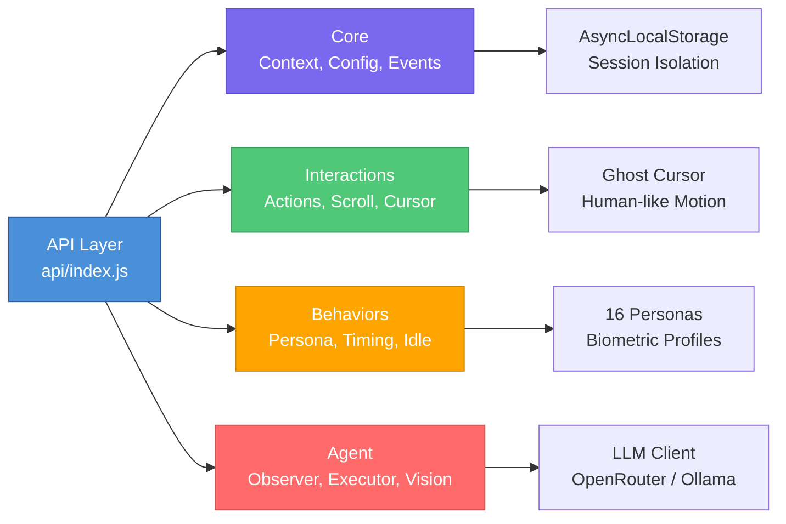

# API Documentation

Welcome to the Unified Browser Tool API documentation. This API provides a high-level, human-mimetic browser automation interface built on Playwright, designed to bypass bot detection through behavioral persona modeling, realistic kinetic movements, and robust error recovery.

## Architecture Overview

For a comprehensive architectural deep-dive, see [ARCHITECTURE.md](./ARCHITECTURE.md).

The API is organized into four main modules:



**Key Design Principles:**
- **Session Isolation**: Each browser page runs in its own `AsyncLocalStorage` context
- **Human Mimicry**: All interactions use persona-driven timing and motion physics
- **Semantic Agent**: LLM-powered interactions via accessibility tree mapping
- **Recovery-First**: Every action includes automatic retry and state recovery

## When To Use Which Module

- Use `api.core` concepts when you need session isolation, config, hooks, logging, or recovery behavior.
- Use `api.interactions` when you want direct browser actions like click, type, hover, scroll, navigate, or wait.
- Use `api.behaviors` when you want to shape typing, cursor movement, attention, idle behavior, or persona selection.
- Use `api.agent` when the task should be driven semantically from labels, screenshots, or the accessibility tree.
- Use `api.utils` when you need file I/O, retry helpers, config helpers, timing, math, or logging utilities.

## Table of Contents

- [Quick Start](#quick-start)
- [Core Concepts](#core-concepts)
- [Module Reference](#module-reference)
    - [Core](#core)
    - [Interactions](#interactions)
    - [Behaviors](#behaviors)
    - [Agent](#agent)
    - [Utils](#utils)
    - [Actions](#actions)
- [Examples](#examples)
- [Project Links](#project-links)

---

## Quick Start

```javascript
import { api } from './api/index.js';

// Isolated session execution
await api.withPage(page, async () => {
    // 1. Initialize with a behavioral persona
    await api.init(page, { persona: 'casual' });

    // 2. Human-like navigation with warmup
    await api.goto('https://example.com');

    // 3. Kinetic actions (automatically handles scroll + cursor move)
    await api.click('.login-button');
    await api.type('#username', 'myuser', { noClear: true }); // noClear: true preserves existing content (default clears field first)
});
```

---

## Core Concepts

### Context & Session Isolation

The API uses `AsyncLocalStorage` to ensure that multiple browser sessions can run concurrently without state leakage.

- **`api.withPage(page, fn)`**: The primary way to scope API calls to a specific page
- **`api.init(page, options)`**: Injects anti-detection patches and sets the persona
- **`api.getPage()`**: Retrieves the current page object
- **`api.clearContext()`**: Clears the current context

### Persona System

16 profiles control biometrics like typing speed, typo rates, and mouse "jitter". Available profiles include: `casual`, `efficient`, `power`, `researcher`, `elderly`, `teen`, `professional`, `gamer`, and more.

- **`api.setPersona(name)`**: Sets the active persona
- **`api.getPersona()`**: Gets the current persona object
- **`api.getPersonaName()`**: Gets the current persona name
- **`api.listPersonas()`**: Lists all available personas

---

## Module Reference

### Core

- **[Core Modules](./core.md)** - Context, config, errors, events, hooks, middleware, plugins

### Interactions

- **[Interactions](./interactions.md)** - Actions, scroll, cursor, navigation, wait, queries, banners

### Behaviors

- **[Behaviors](./behaviors.md)** - Persona, timing, attention, idle, recovery, warmup

### Agent

- **[Agent](./agent.md)** - Observer, executor, finder, vision, runner

### Utils

- **[Utils](./utils.md)** - File I/O, memory, patch, retry, config

### Actions

- **[Actions](./actions.md)** - Twitter-specific actions (like, retweet, follow, etc.)

---

## Examples

### Basic Navigation and Click

```javascript
await api.withPage(page, async () => {
    await api.init(page, { persona: 'casual' });
    await api.goto('https://twitter.com');
    await api.click('[data-testid="login"]');
    await api.type('#username', 'myuser');
    await api.type('#password', 'mypass');
    await api.click('[data-testid="Login_Button"]');
});
```

### Using Agent for Semantic Interaction

```javascript
await api.withPage(page, async () => {
    await api.init(page, { persona: 'researcher' });
    await api.goto('https://example.com');

    // Get semantic map of the page
    const view = await api.agent.see();

    // Click by label
    await api.agent.do('click', 'Login');

    // Type by label
    await api.agent.do('type', 'Username', 'myuser');
});
```

### File I/O for Multi-Agent

```javascript
// Read a random line (thread-safe)
const account = await api.file.readline('accounts.txt');

// Read and remove a line (for exclusive assignment)
const assigned = await api.file.consumeline('accounts.txt');
```

### Recovery and Error Handling

```javascript
// Smart click with auto-recovery
await api.smartClick('.dynamic-button', {
    recovery: true,
    maxRetries: 3,
});

// Find element by scrolling if not visible
await api.findElement('.lazy-loaded-content');

// Recover from unexpected navigation
await api.recover();
```

## Project Links

- [Architecture](./ARCHITECTURE.md) - System diagrams and internal flow
- [Core Modules](./core.md) - Context, config, errors, events, hooks, middleware, plugins
- [Interactions](./interactions.md) - Actions, scroll, cursor, navigation, wait, queries
- [Behaviors](./behaviors.md) - Persona, timing, attention, idle, recovery, warmup
- [Agent](./agent.md) - LLM-powered semantic interactions
- [Utils](./utils.md) - File I/O, memory, patch, retry, config, timing
- [Actions](./actions.md) - Twitter-specific actions
- [LLM Providers](./LLM-PROVIDERS.md) - Local and cloud model setup
- [API Overview](./_api-overview.md) - Short high-level summary

---

## Error Handling

The API provides a comprehensive error hierarchy:

- `AutomationError` - Base error class
- `SessionError` - Session-related errors
- `ContextError` - Context management errors
- `ElementError` - Element interaction errors
- `ActionError` - Action execution errors
- `NavigationError` - Navigation errors
- `LLMError` - AI/LLM-related errors
- `ValidationError` - Input validation errors

---

## Configuration

```javascript
// Set custom configuration
await api.config.set('humanization.enabled', true);
await api.config.set('agent.provider', 'openrouter');

// Get configuration
const value = await api.config.get('humanization.enabled');
```

---

## Events and Plugins

```javascript
// Listen to events
api.events.on('before:navigate', (data) => {
    console.log('Navigating to:', data.url);
});

// Register a plugin
api.plugins.register({
    name: 'my-plugin',
    hooks: {
        'before:click': async (selector) => {
            console.log('Clicking:', selector);
        },
    },
});
```

---

## Additional Resources

- [API Overview](../_api-overview.md) - High-level overview
- [GitHub Repository](https://github.com/your-repo) - Source code
- [Playwright Documentation](https://playwright.dev) - Underlying browser automation framework
